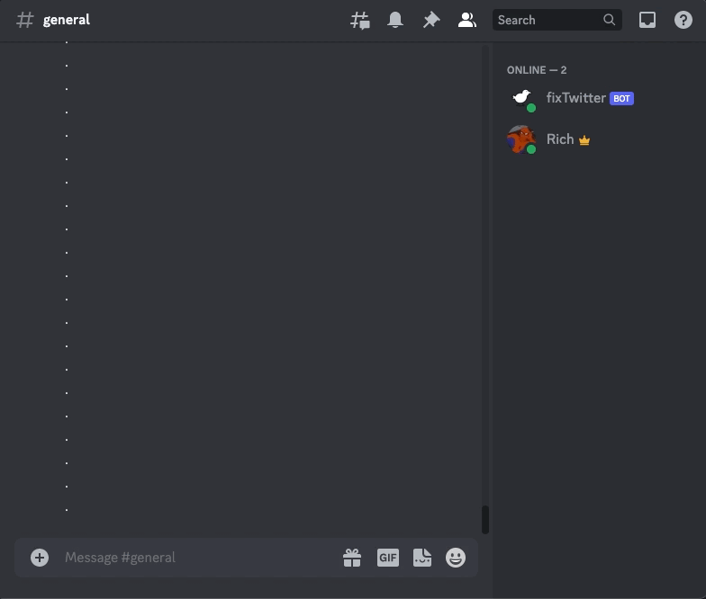

# fixTwitter Bot

## Introduction
fixTwitter is a Discord bot that detects X or Twitter links and converts them to "fixupx" links. It is written in Python and requires a `BOT_TOKEN` equal to the Discord Bot API token.

At the moment this is not hosted on any server, for users who would like to make use of it you will need the `BOT_TOKEN` and to run `main.py` on a machine of your choosing.

You can clone this repo using:

```bash
gh repo clone rsh52/fixTwitter
```

# Usage

The `fixTwitter` bot responds to prompts starting with `??`. Once prompted, the bot will respond with a link to the fixupx version of the Twitter/X link if it detects "x.com" or "twitter.com" in the message. This will delete the original users message, but provide a new link from the `fixTwitter` bot along with a message indicating who requested the fixupx link.



# Getting Started

## Setting Up the Bot - Discord Side

To set up a Discord bot, you will need to create a new application on the [Discord Developer Portal](https://discord.com/developers/applications). Once you have created a new application, you will need to create a bot for that application. This can be done by clicking on the "Bot" tab on the left hand side of the screen and then clicking "Add Bot". Note that the appropriate permissions will need to be applied to the servers you wish to have the bot work with.

Be sure to generate and save a token from the "Bot" panel. This will be critical and unique for your purposes. Give your bot a name (feel free to use fixTwitter, or whatever else you like) and a fun icon.

Under the "OAuth2" tab, select the "bot" scope, "Moderate Members" under the general permissions, and all options under text permissions. Do this first under "General" and then again under "URL Generator." The URL generator will provide a URL that will let you invite the bot to servers of your choosing.

## Setting Up the Bot - Developer Side

Fortunately, the heavy lifting has mostly been done at this point! It's up to the developer to decide how they wish to host the bot.

> I have chosen to use a Raspberry Pi Model 3 with set up with Ubuntu and run via `screen`. I have also chosen to use a virtual environment to run the bot. This is not necessary, but I have found it to be acceptable for personal use in my social servers. Other options include AWS, Google Cloud, Heroku, or any other hosting service that can run Python. For me, the Raspberry Pi was the most cost effective option and I had one lying around.

As mentioned above, once a hosting location has been identified, simply clone or fork the repo:

```bash
gh repo clone rsh52/fixTwitter
```

Using your terminal, `cd` to the location, set up your virtual environment, and install the packages listed in the `requirement.txt` file (refer to the [Python docs](https://packaging.python.org/en/latest/guides/installing-using-pip-and-virtual-environments/#using-requirements-files) for more information on this process).

Now all that's needed is to run `python3 main.py` and the bot should be up and running! You can confirm by checking the bot's status in the server you invited it to. Try out locally first to see it in action.
